# 

## 👨‍💻 About Me

A passionate **Next.js & TypeScript developer** focused on building scalable, modern, and performance-driven web applications.

- 🌐 Website: **https://abyn.xyz**
- 📫 Email: **abyn@abyn.xyz**
- ⚡ Fun fact: **meow**

## 🛠️ Tech Stack

## 📊 GitHub Metrics

🕒 Last Updated: 2026-02-28 16:13 UTC

  
  

## 🎧 Currently Listening

Here’s what I’ve been playing recently on Spotify:

  

## 🤝 Connect With Me

